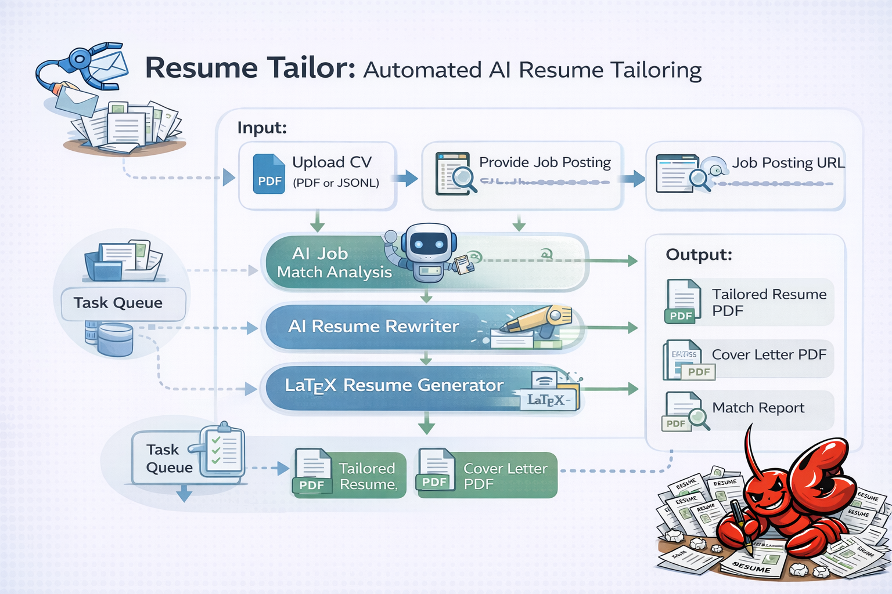

# ResumeOpenClaw

A Claude Code slash command that turns a raw CV (PDF or JSONL) + a job posting URL into a fully tailored, job-specific LaTeX PDF resume — in one command.


## What It Does

```
/resume-tailor <your-cv.pdf or resume.jsonl> <job-posting-url>
```

Runs a 6-step pipeline powered entirely by Claude:

| Step | Action |
|------|--------|
| **0** | *(PDF only)* Read CV → extract structured JSONL |
| **1** | Load resume data + scrape job posting |
| **2** | Match analysis: score (0–100), skill gaps, experience ranking |
| **3** | Rewrite resume content targeting this specific role |
| **4** | Generate resume LaTeX using Jake's Resume template |
| **5** | Compile resume to PDF via Tectonic |
| **6** | Write cover letter → generate LaTeX → compile to PDF |

**Output (5 files, saved next to your input CV):**
```
tailored_[Company]_[Title].tex        — Resume LaTeX source
tailored_[Company]_[Title].pdf        — Ready-to-send resume
coverletter_[Company]_[Title].tex     — Cover letter LaTeX source
coverletter_[Company]_[Title].pdf     — Ready-to-send cover letter
match_report_[Company]_[Title].md     — Match score + gap analysis
```

## Design Principles

- **No invented content** — Claude reframes your existing experience using the job's language; it never fabricates metrics or skills
- **ATS-aware** — keywords from the job description are woven in naturally
- **Selective** — only the 3–4 most relevant experiences and 2–3 most relevant projects are included
- **LaTeX quality** — outputs a clean, professional PDF based on [Jake's Resume](https://github.com/jakegut/resume), the most widely used CS/MLE resume template on Overleaf

## Requirements

- [Claude Code](https://claude.ai/code) (the slash command runs inside it — no API key needed)
- [Tectonic](https://tectonic-typesetting.github.io/) for LaTeX → PDF compilation

  ```bash
  # Windows: download tectonic.exe from https://github.com/tectonic-typesetting/tectonic/releases
  # macOS:
  brew install tectonic
  # Linux:
  curl --proto '=https' --tlsv1.2 -fsSL https://drop.Fuller.li/tectonic/install.sh | sh
  ```

> **Note:** The tectonic path is currently hardcoded to `C:\Users\zongr\tectonic_bin\tectonic.exe`. Update line in `commands/resume-tailor.md` if your path differs.

## Installation

### Option A — Personal command (available in all projects)

```bash
cp commands/resume-tailor.md ~/.claude/commands/resume-tailor.md
```

### Option B — Project-level command (this project only)

```bash
mkdir -p .claude/commands
cp commands/resume-tailor.md .claude/commands/resume-tailor.md
```

## Usage

### With a PDF CV

```
/resume-tailor C:\path\to\your-cv.pdf https://jobs.example.com/posting/123
```

Step 0 automatically extracts your CV into `resume.jsonl`, then runs the full pipeline.

### With an existing JSONL

```
/resume-tailor C:\path\to\resume.jsonl https://jobs.example.com/posting/123
```

Skips Step 0 and runs Steps 1–5 directly. Faster for repeat use.

### Generating the JSONL once, reusing it many times

```bash
# First time: extract from PDF
/resume-tailor C:\Downloads\my-cv.pdf https://job1.com

# All subsequent jobs: reuse the generated JSONL
/resume-tailor C:\Downloads\resume.jsonl https://job2.com
/resume-tailor C:\Downloads\resume.jsonl https://job3.com
```

## JSONL Schema

If you want to create or edit your resume data manually, each line is one section:

```jsonl
{"section": "personal", "name": "...", "email": "...", "location": "...", "website": "..."}
{"section": "education", "entries": [{"institution": "...", "degree": "...", "gpa": "...", "start": "...", "end": "...", "notes": ["..."]}]}
{"section": "skills", "categories": [{"name": "...", "items": ["...", "..."]}]}
{"section": "experience", "entries": [{"organization": "...", "title": "...", "start": "...", "end": "...", "project": "...", "bullets": ["..."]}]}
{"section": "projects", "entries": [{"name": "...", "url": "...", "description": "...", "tech_stack": ["..."], "key_features": ["..."]}]}
{"section": "publications", "entries": [{"id": 1, "authors": "...", "year": 2025, "title": "...", "venue": "...", "status": "published", "doi": "..."}]}
{"section": "honors", "entries": [{"title": "...", "amount": "...", "date": "..."}]}
```

## Project Structure

```
resume-tailor-skill/
├── .claude-plugin/
│   └── plugin.json          # Plugin metadata
├── commands/
│   └── resume-tailor.md     # Full pipeline definition (slash command)
└── README.md
```

## How the Pipeline Works



```
Input: CV (PDF or JSONL) + Job URL
         │
         ▼
[Step 0] Read PDF → parse all sections → save resume.jsonl
         │                              (skipped if input is already .jsonl)
         ▼
[Step 1] Load resume data
         WebFetch job page → extract title, company, required skills,
         responsibilities, keywords
         │
         ▼
[Step 2] Match analysis
         Score 0–100 · matched skills · skill gaps
         Experience ranking by relevance · reframing recommendations
         Tailored summary draft
         │
         ▼
[Step 3] Rewrite content
         Bullets reframed with JD language · top 3–4 experiences selected
         Top 2–3 projects selected · skills reordered by relevance
         │
         ▼
[Step 4] Generate LaTeX
         Tailored content → Jake's Resume template
         Math symbols rendered (R², p<0.001, AUC, ×)
         GitHub links embedded in project headings
         │
         ▼
[Step 5] Compile resume PDF
         tectonic resume.tex → resume.pdf
         Auto-retry on LaTeX errors
         │
         ▼
[Step 6] Write cover letter
         4-paragraph structure: hook → fit → why this company → close
         Generate LaTeX → tectonic cover.tex → cover.pdf
         │
         ▼
Output: resume.tex + resume.pdf + cover.tex + cover.pdf + match_report.md
```
## Tips

- **Keep your JSONL updated** as you gain new experience — it's your master resume data source
- **Check the match report** before sending; the gap analysis tells you what to address in your cover letter
- Works with any job board URL: Greenhouse, Lever, LinkedIn, Workday, company career pages, etc.

## Credits

### LaTeX Resume Template
**[jakegut/resume](https://github.com/jakegut/resume)** by [Jake Gutierrez](https://github.com/jakegut)
The resume PDF layout is based on Jake's Resume, the most widely used LaTeX resume template for software engineering and ML roles. Originally derived from [sb2nov/resume](https://github.com/sb2nov/resume) by Sourabh Bajaj.
Licensed under [MIT License](https://github.com/jakegut/resume/blob/master/LICENSE).

### Pipeline Architecture Inspiration
**[Ztrimus/ResumeFlow](https://github.com/Ztrimus/ResumeFlow)** by [Ztrimus](https://github.com/Ztrimus)
The idea of an end-to-end LLM pipeline that takes a job URL + master resume and produces tailored application materials was inspired by ResumeFlow. This project reimplements that concept as a Claude Code slash command with LaTeX PDF output.
Published at ACM SIGIR 2024 ([arXiv:2402.06221](https://arxiv.org/abs/2402.06221)).

### LaTeX Compiler
**[Tectonic](https://tectonic-typesetting.github.io/)** — a self-contained, cross-platform LaTeX/XeTeX engine that downloads only the packages it needs. No full TeX Live installation required.
Licensed under [MIT License](https://github.com/tectonic-typesetting/tectonic/blob/master/LICENSE).

### AI Engine
**[Claude](https://claude.ai)** by [Anthropic](https://anthropic.com) — powers all pipeline steps (parsing, matching, rewriting, LaTeX generation) via [Claude Code](https://claude.ai/code).
